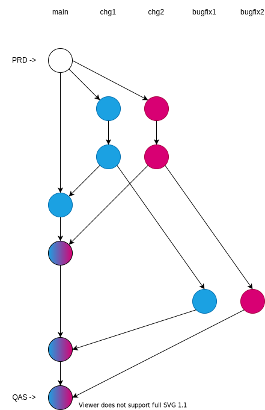

# The case of two ALV reports and git for deployment

## Scenario?

Assumption: QAS system and PRD system

Assumption: the two ALV reports already exist in QAS and PRD

Assumption: the two ALV reports are in the same git repository(because, clearly we don't want to have one repository per object?)

Two developers, two changes,

CHG1: Add new column COL1 to ZALV1

CHG2: Add new column COL2 to ZALV2

both developers create a branch, and push two commits,

Development finishes, reviewed, QA'ed and all, say CHG1 before CHG2, say simple classic merge, deployed to QAS for business testing,

It happens that each change contains a bug, the developers create bugfixes in new branches, the old ones have been merged.
(Assumption: dont rewrite history)

CHG1 is accepted by business before CHG2, and would like to urgently have the change in production.

But none of the commits in the history have a consistent state for deployment of CHG1, they will all draw some unwanted changes from CHG2!

## Solutions?

Making releases to customers every 3 months(like some large software companies) will of cause solve the issue, but it should not be the benchmark in a world with buzzword trends.

Add commits to rollback CHG2? Possible, but not feasible, think of a system with 10 developers and 100 changes in flight.

Test every change in isolation on separate systems => every change needs a full SAP system running, not feasible due to cost, not feasible as QAS systems are typically connected to landscape.

Test one change at a time on QAS system, not feasible, continuous waiting and coordination.

Only have one change in-progress per repository => not buzzword friendly => not feasible

With classic CTS the blue and red changes are not intertwined, but must be manually kept track of(tooling does exist, and solutions are known to not get into this kind of trouble).

Create feature toggles for all changes, hmm

Use git for development, not deployment. SAP offers great tooling like CTS to deploy to complex landscapes with massive amounts of code.

[Cherry picking](https://medium.com/captain-contrat-engineering/cherry-picking-our-way-to-production-fc36968c7664)? Yeap, well, it rewrites history, which we'd probably not like to do as default for critical business systems.

> It feels like it would end up with the same as STMS, a list of branches for each system that has not been merged to that system/branch yet, with similar pitfalls as CTS.
>
> Each traditional CTS transport can be seen as a “mini” branch for the objects that it contains, which is automatically rebased when imported to the target system. It would also be possible to put every object in its own package to simulate this behavior in git, but it would be a lot of work and not help developers.
>
> Reference https://blogs.sap.com/2020/11/05/cts-is-beautiful/

Classic CTS is also not perfect, but challenges are well understood and tooling(partner and SAP) for mitigation exists.

[Re-thinking feature branch deployments](https://octopus.com/blog/rethinking-feature-branch-deployments)

Branches per system, multiple repos, multiple rebasing PRs => classic CTS is easier, and deployment should be centralized(?)

Note bugfixes could be based of the original branch, but will give the same result, plus sequence of the last two merges does not change the outcome,

## With Classic CTS

Developer 1 does changes for CHG1 in DEVK900001

Developer 2 does changes for CHG2 in DEVK900002

Release transport of copies to QAS when development is done

Bugfixes are added in the open transport, and TOC released to QAS again

Release the transport to move the isolated change to production

* Auditing ignored, just like the git scenario
* Systems out of sync ignored, just like the git scenario
* Dependencies/sequences ignored, just like the git scenario
